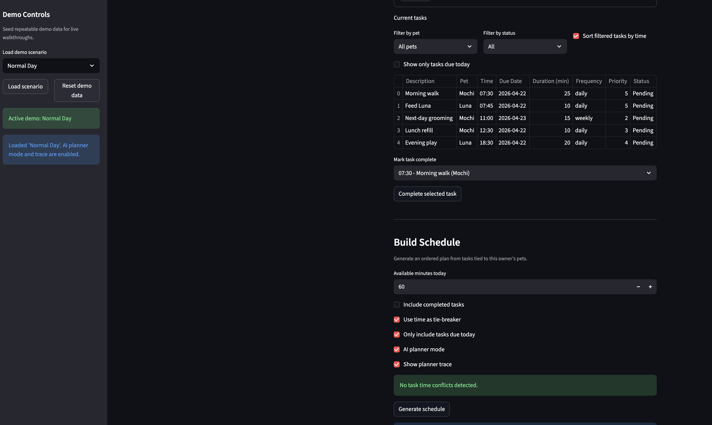
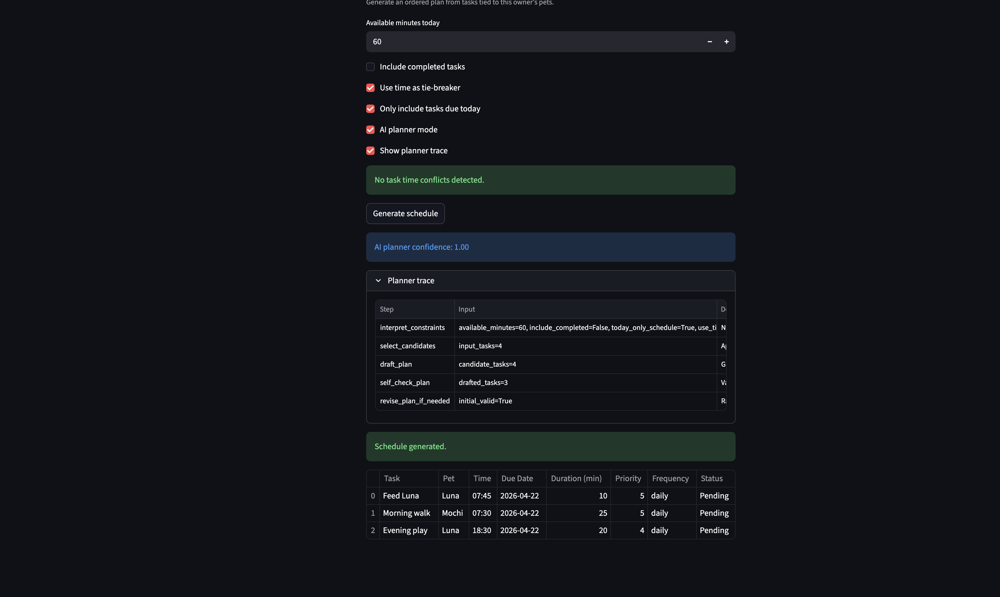
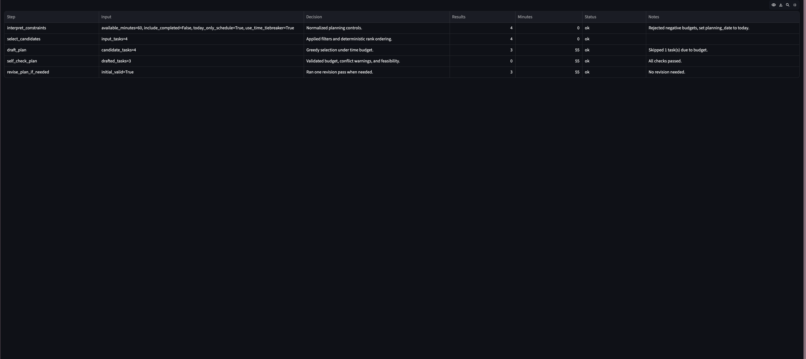

# PawPal+ Project 4: Agentic AI Planner Mode

## Video Demo Walkthrough
[▶ Click here to Watch the Video Demo on Google Drive](https://drive.google.com/file/d/1zefClybibdvtxhpdNgjx9lXrf4HlA6lV/view?usp=sharing)

## 1. Original Project Context (Modules 1-3)

The original PawPal+ project is a pet care scheduling app built in Python and Streamlit. It lets a user create pets, add care tasks with duration/priority/time, and generate a daily schedule under a time budget.

Modules 1-3 focused on deterministic scheduling logic (`pawpal_system.py`) plus a lightweight Streamlit interface (`app.py`). Core capabilities included task filtering, priority ordering, conflict detection warnings, and recurrence handling for daily/weekly tasks.

## 2. Project 4 - PawPal+ with Agentic Planner Mode

**Project 4 Title:** PawPal+ Agentic Planner Mode with Reliability Layer

This extension adds an explicit agentic workflow to schedule generation so intermediate reasoning steps are visible and testable. It also adds a reliability layer (self-check + revision + evaluation harness) so planning quality can be measured instead of assumed.

## 3. Architecture Overview

When AI Planner Mode is enabled, schedule generation follows a five-step pipeline in `ai_planner.py` and returns the final plan with trace, confidence, and warnings.

```text
[User Inputs in Streamlit]
        |
        v
[app.py UI Layer]
        |
        +--> (baseline) Scheduler.generate_schedule
        |
        +--> (AI Planner Mode ON)
                |
                v
        [ai_planner.py Pipeline]
        1) Interpret Constraints
        2) Select Candidates
        3) Draft Plan
        4) Self-Check
        5) Revise if Needed
                |
                +--> Trace + Confidence + Warnings
                v
         [Final Schedule Table]
                |
                v
      [Reliability Layer: eval_ai.py + tests]
                |
                v
        [Human review in UI]
```

## 4. Setup Instructions

Run all commands from the repo root.

```bash
python -m venv .venv
source .venv/bin/activate  # Windows: .venv\Scripts\activate
pip install -r requirements.txt
```

Run the app:

```bash
streamlit run app.py
```

Run tests:

```bash
python -m pytest
```

Run evaluation harness:

```bash
python eval_ai.py
```

## 5. Sample Interactions (Input -> AI Planner Output)

### Example 1: Tight budget
- **Input:** `available_minutes=15`, `today_only_schedule=True`, `include_completed=False`
- **Output:** planner keeps the highest-priority fitting task and skips longer lower-priority tasks.
- **Trace highlight:** `draft_plan` shows budget-based skips; `self_check_plan` passes budget constraint.

### Example 2: Conflict-heavy tasks
- **Input:** multiple tasks at `07:30`, `use_time_tiebreaker=True`
- **Output:** planner revises by removing lower-utility same-time conflicts and keeps one task in that slot.
- **Trace highlight:** `self_check_plan` warns on conflicts, then `revise_plan_if_needed` resolves overlap.

### Example 3: Normal planning day
- **Input:** `available_minutes=90`, mixed priorities/times
- **Output:** stable prioritized schedule with confidence near 1.0 and full five-step trace.
- **Trace highlight:** all required steps appear: interpret -> select -> draft -> self-check -> revise.

## 6. Design Decisions & Trade-offs

- **Deterministic planner over external LLM calls:** improves reproducibility, unit testing, and local execution reliability.
- **Interpretability over complexity:** pipeline emits trace rows for each step so users can inspect decisions.
- **Guardrail-first behavior:** negative budgets are rejected, empty candidate sets are handled gracefully, and conflict checks are non-blocking but surfaced.
- **Single revision pass:** keeps behavior predictable and easy to debug, at the cost of less exhaustive optimization.

## 7. Testing Summary

- Added planner tests in `tests/test_ai_planner.py` covering:
  - time budget enforcement
  - high-priority task selection
  - conflict-triggered revision behavior
  - full five-step trace presence
  - confidence bounds in `[0, 1]`
- Existing tests in `tests/test_pawpal.py` and `tests/test_ui_helpers.py` continue to validate domain and UI helper behavior.
- Evaluation harness in `eval_ai.py` runs fixed scenarios and prints a scoreboard.
- Latest harness run produced `passed/total: 6/6`, `avg confidence: 0.950`, `failed scenario names: None`.

## 8. Reflection

I am most satisfied with shipping a working final project that satisfies the rubric's needs.
If I had another iteration, I would redesign the UI & UX on the streamlit UI.
The most important thing I learned about working with AI on this project is how important it is
to come up with a great plan before implementation with AI.

**a. Limitations and potential biases**

The AI planner in this project is deterministic and rule-based, which is good for reproducibility,
but it still has limits. It optimizes using a fixed priority-first heuristic, so it may under-value
context that is hard to represent as a numeric priority (for example, stress level of a pet,
caregiver fatigue, or travel/setup overhead between tasks).

There is also potential bias in user-provided priorities. If a user consistently marks one class of
tasks as low priority, the system may repeatedly defer them even when they matter for long-term
health outcomes. In other words, the planner is only as fair as the inputs and scoring policy.

**b. Misuse risks and prevention steps**

One misuse risk is over-trusting the schedule as if it were medical advice. Another is using the
tool to justify neglecting tasks because they were not selected under a tight budget.

To reduce misuse, I designed guardrails and messaging that keep the human in control:
- conflict checks are warnings, not silent failures
- planner trace is visible so decisions can be inspected
- confidence is surfaced as a heuristic, not a guarantee
- users can run baseline scheduler mode and compare outputs

In future iterations, I would add stronger UI disclaimers (especially for medication tasks), and
explicitly require user confirmation when high-priority health tasks are skipped.

**c. Testing surprise**

The biggest testing surprise was how useful trace-based assertions were. Initially I focused on
final schedule outputs only, but validating each pipeline stage (`interpret`, `select`, `draft`,
`self_check`, `revise`) caught issues faster and made failures easier to diagnose.

I also found that deterministic fixtures with fixed times/priorities made tests much easier to
maintain than broad randomized scenarios.

**d. One helpful AI suggestion and one flawed AI suggestion**

Helpful AI suggestion:
- Add a dedicated planner output dataclass (`final_schedule`, `trace`, `confidence`, `warnings`).
  This improved interface clarity and made app integration and testing cleaner.

Flawed AI suggestion:
- Rename or reshape core domain concepts (for example, replacing `Owner` with a different user
  model) too early in the project. I rejected this because it did not match existing project scope
  and would have created unnecessary churn.

This contrast reinforced a key practice for me: use AI for acceleration, but keep architecture and
scope decisions aligned to explicit project requirements.


## Demo Screenshots of Input & Output

<a href="assets/app_01.png" target="_blank"></a>

<a href="assets/app_02.png" target="_blank"></a>

<a href="assets/app_03.png" target="_blank"></a>
