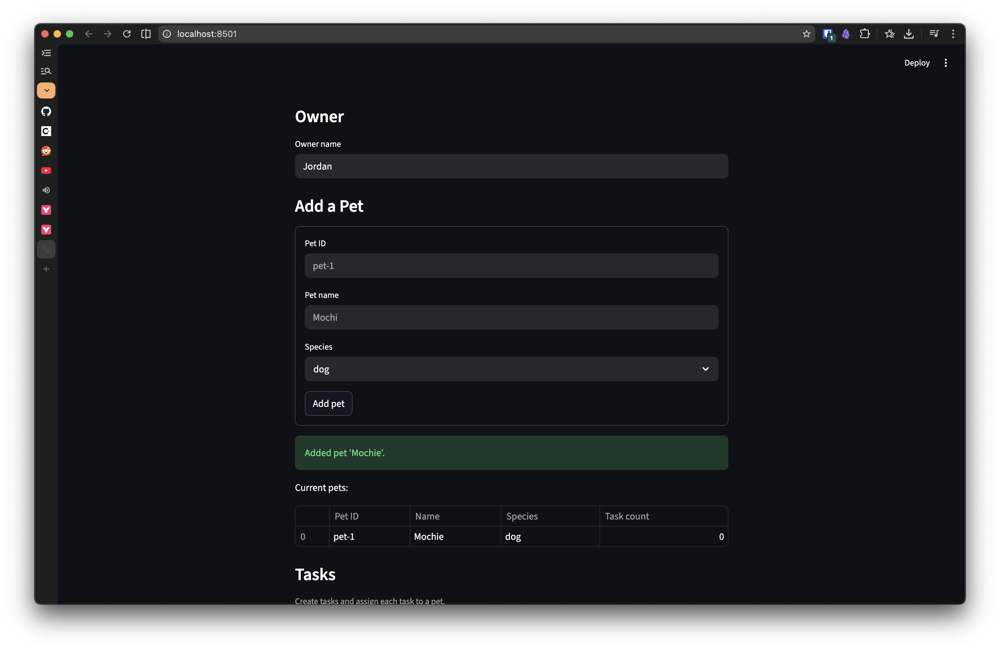
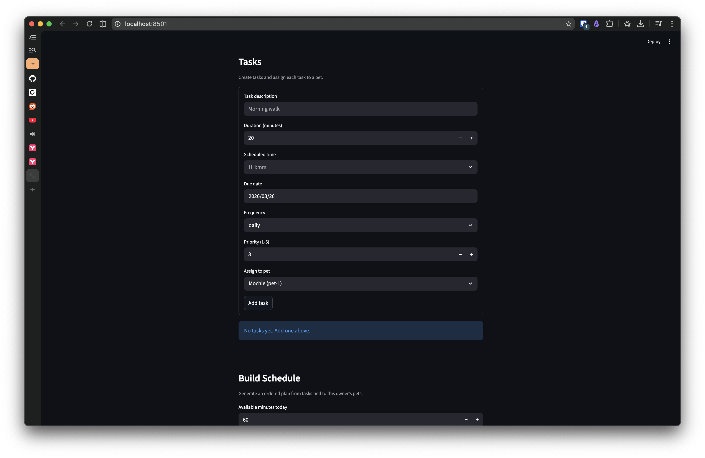
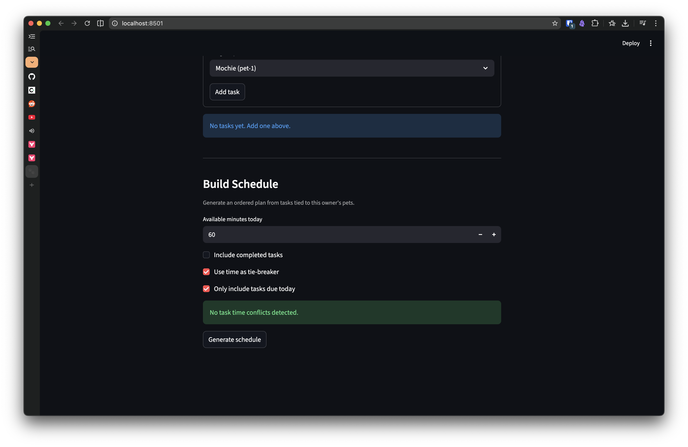

# PawPal+

PawPal+ is a Streamlit app that helps a pet owner organize care tasks, prioritize what matters, and build a realistic daily plan.

## Features

- **Owner + Pet management:** create an owner profile, add multiple pets, and assign tasks per pet.
- **Sorting by time (`HH:MM`):** tasks can be ordered chronologically with a dedicated scheduler method.
- **Priority-based schedule generation:** tasks are ranked by priority with optional time-based tie-breaking.
- **Time-budget planning:** generate a schedule constrained by available minutes.
- **Task filtering:** filter by completion status and pet name for focused review.
- **Daily recurrence automation:** completing a `daily` task auto-creates the next instance for `due_date + 1 day`.
- **Weekly recurrence automation:** completing a `weekly` task auto-creates the next instance for `due_date + 7 days`.
- **Conflict warnings:** detect duplicate task times and show non-blocking warnings for same-pet or cross-pet conflicts.
- **Due-date focus:** optional “today only” filtering to keep plans actionable.

## Getting Started

### Setup

```bash
python -m venv .venv
source .venv/bin/activate  # Windows: .venv\Scripts\activate
pip install -r requirements.txt
```

### Run the Streamlit app

```bash
streamlit run app.py
```

## Testing PawPal+

Run the automated test suite from the project root:

```bash
python -m pytest
```

The tests cover core scheduling behavior, including chronological sorting, recurrence generation, conflict detection, completion handling, and due-date filtering helpers.

**Confidence Level:** ★★★★☆ (4/5)

The current suite passes and validates the most important scheduling logic paths. Confidence is strong for core behavior, with room to increase through full UI/integration test coverage.

## 📸 Demo

<a href="final_streamlit_app_01.png" target="_blank"></a>

<a href="final_streamlit_app_02.png" target="_blank"></a>

<a href="final_streamlit_app_03.png" target="_blank"></a>
